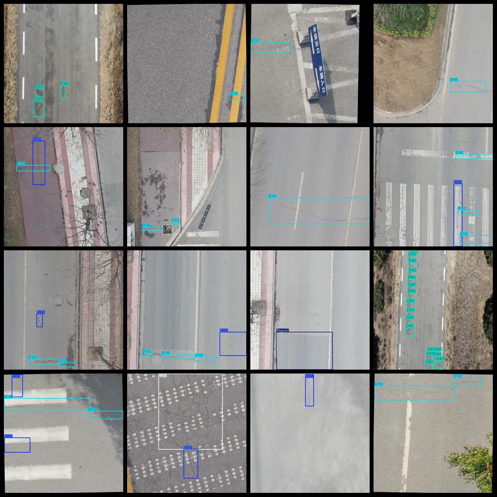
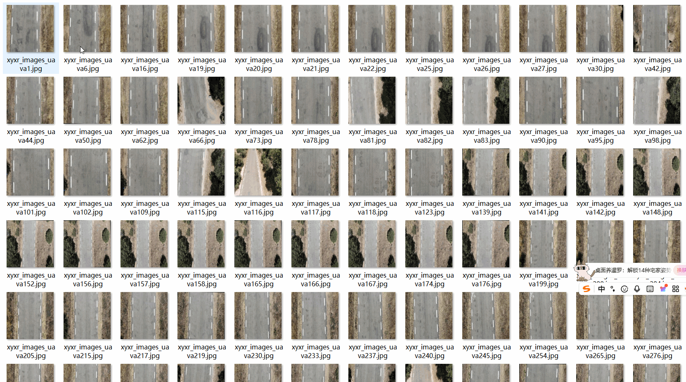

# Aerial Road Damage and Crack Detection Dataset 1119 images YOLO-VOC format

The aerial road damage and crack detection dataset consists of 1119 images in the VOC+YOLO format. The dataset is divided into three folders: JPEGImages, Annotations, and labels. The JPEGImages folder contains a total of 1119 jpg images. The Annotations folder consists of 1119 xml files, and the labels folder contains 1119 txt files. There are a total of 5 types of labels: ["D00", "D10", "D20", "D40", "Repair"]. Each label has a different number of frames (the frame count for each category in the YOLO format may not be consistent with this order, but it is based on the classes.txt file in the labels folder).

Here are the counts for each label:

D00: 678 (longitudinal cracks)

D10: 499 (transverse cracks)

D20: 116 (mesh cracks)

D40: 1189 (repair areas)

Repair: 344 (repaired areas)

Total frames: 2826

The image resolution is clear.

The images have not been enhanced.

The shape of the labels is rectangular boxes, used for object detection recognition.

Important note: No guarantees are made regarding the accuracy or precision of the trained models or weight files. The dataset provides accurate and reasonable annotations only.

Annotation and image conditions are as follows:

## Images

---

Here is a pay link on Stripe (https://buy.stripe.com/3cs8yP7sY87d0vu9AB). Please contact me lonlonago@foxmail.com after funding $89, and I will send you a complete data files, thank you!

